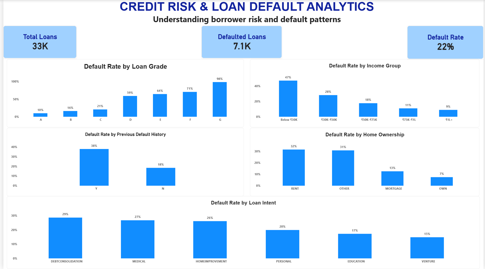

# Credit Risk & Loan Default Analysis

## Project Overview

This project analyzes borrower and loan characteristics to identify factors associated with loan defaults.

The analysis focuses on understanding default patterns across loan grades, income groups, previous default history, home ownership, and loan intent.

## Dashboard Preview

## Tools Used

- Microsoft Excel
- Power BI
- SQL
- Python
- Pandas

## Dataset

- 32,576 loan records
- 12 key features after data cleaning

The dataset contains borrower demographics, income, employment information, loan details, credit history, and loan repayment status.

## Data Cleaning & Preparation

The dataset was cleaned and prepared for analysis by:

- Handling missing loan interest rates using the median value
- Retaining missing employment length as "Unknown"
- Reviewing anomalous age records
- Creating Loan Amount Band
- Creating Age Group
- Creating Income Group

## Key Performance Indicators

- **Total Loans:** 33K
- **Defaulted Loans:** 7.1K
- **Overall Default Rate:** 22%

## Dashboard Analysis

The Power BI dashboard analyzes:

1. Default Rate by Loan Grade
2. Default Rate by Income Group
3. Default Rate by Previous Default History
4. Default Rate by Home Ownership
5. Default Rate by Loan Intent

## Key Insights

- Loan Grade A had a default rate of approximately **9.96%**, while Grade G recorded approximately **98.44%**.
- Borrowers with income below 30K had a default rate of approximately **47.01%**, compared with **8.93%** for borrowers with income of 1L+.
- Borrowers with previous default history had a default rate of approximately **37.81%**, compared with **18.40%** for borrowers without previous default history.
- Renters recorded a default rate of approximately **31.58%**, compared with **7.47%** for homeowners.
- Debt consolidation loans recorded a default rate of approximately **28.59%**, while venture loans recorded approximately **14.82%**.

## Skills Demonstrated

- Data Cleaning
- Exploratory Data Analysis
- Excel Analysis
- SQL
- Python & Pandas
- Power BI
- KPI Analysis
- Data Visualization
- Credit Risk Analysis
- Business Insight Generation

## Project Files

- [Project Report](CREDIT%20RISK%20ANALYTICS%20PROJECT.docx) – Project documentation and analysis
- [Excel Analysis](credit_risk_cleaned.csv.xlsx) – Cleaned dataset and KPI analysis
- [Power BI Dashboard](credit_risk_cleaned.pbix) – Interactive credit risk dashboard

## Conclusion

The analysis highlights how borrower income, loan grade, previous default history, home ownership, and loan intent are associated with differences in loan default rates.

The project demonstrates an end-to-end analytical workflow covering data cleaning, analysis, KPI development, visualization, and business insight generation.
